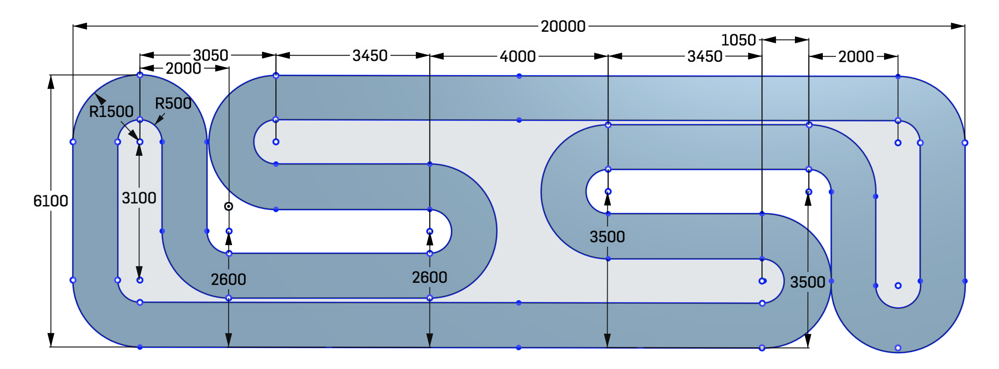

# Reglement du championnat DIY Robocars saison 4

## saison 4
- 6 journées de course
- 4 courses par journée de course (2xSPRINT-1xBATTLE-1xRACE)

## Sponsor
- Renault Digital est toujours sponsor principal
- Renault Digital fournit le local permettant d'accueillir la piste et 75 personnes
- Renault Digital offre le petit-déjeuner
- Renault Digital offre le déjeuner

## Types de courses
- SPRINT (chrono sur 2 tours consécutifs sans sortir de la piste)
- BATTLE (affrontement 1 contre 1) le premier qui termine 2 tours avec grille de départ basée sur les temps du sprint
- RACE de 1 tours avec grille de départ basée sur les temps du sprint

## Essais libres
Chaque équipe aura 12 minutes d'essais libres sur la piste le matin

## Règlement voitures
- Les voitures peuvent disposer de tous les capteurs souhaités sans limite
- La puissance de calcul embarquée n'est pas limitée
- La voiture doit être complètement autonome au moment des épreuves
- Pas de système de geolocalisation interne autorisé pour le moment

## Obstacles
- Pas d'obstacles prévus pour le moment
- Idée: rampes rouges de 15cm de haut et à 30° de 50cm de large. 2 par circuit
- Idée: bosses de 5cm de haut par 1m de large et 15cm de long à 1m avant l'entrée des virages de bouts de lignes droites 2 par circuit

## sorties de piste
- Court-circuiter un cône à l'intérieur d'un virage entraine une élimination de la course en cours
- Idée: roues à l'extérieur de la ligne blanche entrainent une élimination de la course en cours

## Piste

- La piste sera la même pour chaque épreuve
- La piste fait 1 mètre de large incluant les bandes de délimitation de 5cm de large
- La piste est délimitée par des bandes blanches continues de 5 cm de largeur.
- Le rayon intérieur des virages est de 50 cm
- La piste s'étendra sur une surface de moquette intérieure d'environ 6m x 20m
- Des cônes à l'intérieur des virages délimiteront la piste

## Eclairage
- Lumiere artificielle avec possibles rayon de soleil par fenêtre
- Idée: course (de nuit) sans éclairage

## Championnat par points
- Des points seront attribués en fonction sur le mode F1 (25, 18,15... points) pour chaque course(sprint,battle et race)
- Les points ne sont attribués que si la voiture relève le challenge (2 tours sans sortir...)
- En l'absence d'au moins 5 finishers, le podium sera honorifique (sans points)
- Les points seront cumulés pour désigner les vainqueurs du championnat

## Prix à gagner
- Pas de prix pour le moment
- Idée: Cagnotte cumulée si au moins 5 voitures termines chaque épreuve: XXX euros par journée ajoutée à la cagnotte
- Idée: Cagnotte activée si au moins 5 voitures termines chaque épreuve

## journées de préparation
- Idée: Démontration de l'utilisation du guide de montage

## Sujets complémentaires

### wifi
- Accès wifi guest toujours à l'étude
- Idée: ???

### Aquisition d'images haute fréquence
- A l'étude permettrait de réduire le temps d'acquisition des données

### Gestion de la lumière
- Utiliser un algo de calibration

### Entraînement des modeles sur gpu sur aws
- https://github.com/robocars/training

### Guide de photo-montage d'une mini voiture autonome
- Idée: organiser des ateliers durant les séances de roulage du matin

### Ressources
- https://www.meetup.com/fr-FR/DIY-Robocars-France (inscriptions au meetups)
- http://diyrobocars.fr (site officiel)
- https://diyrobocars-france.slack.com (Principal moyen de communication entre racers)
- @diyrobocars_fr 
- "diyrobocars france" (Chaîne Youtube) (Videos des courses lorsque c'est possible)
- https://github.com/robocars (code partagé)
